# 基于springboot的人口老龄化社区服务系统

#### 介绍

随着人口老龄化趋势的加剧，为了更好地满足老年人的生活需求，提供优质的社区服务，我们开发了基于 Spring Boot 的人口老龄化社区服务系统。该系统旨在整合社区资源，为老年人提供便捷、高效、贴心的服务，同时提高社区服务的管理水平和工作效率。

#### 技术栈

后端技术栈：Springboot+Mysql+Maven

前端技术栈：Vue+Html+Css+Javascript+ElementUI

开发工具：Idea+Vscode+Navicate

#### 系统功能介绍

（一）管理端  
用户管理：对系统中的所有用户（包括老年人和员工）的信息进行全面管理，包括注册审核、信息修改、权限设置等。  
员工管理：负责员工的招聘、入职、离职等流程，以及员工的岗位分配、工作安排和绩效考核等。  
社区信息管理：维护社区的基本信息，如社区名称、地址、面积、设施等，确保信息的准确性和完整性。  
老人信息管理：详细记录老年人的个人信息，包括姓名、年龄、健康状况、家庭情况等，为提供个性化服务提供依据。  
社区文件管理：对社区相关的各类文件进行分类存储、检索和更新，如政策文件、服务协议、活动方案等。  
走访任务管理：制定走访计划，分配走访任务给员工，确保定期对老年人进行关怀和了解需求。  
走访信息管理：收集和整理走访过程中获取的信息，如老年人的生活状况变化、需求反馈等。  
社区服务管理：对社区提供的各项服务进行统筹规划和监督，包括服务项目的设立、服务质量的评估等。  
系统管理：进行系统的配置、维护和安全管理，保障系统的稳定运行和数据安全。  

（二）员工端  
社区信息：随时了解社区的基本情况和最新动态，以便更好地开展工作。  
社区活动：组织和参与各类社区活动，如文体活动、健康讲座等，并负责活动的策划、宣传和执行。  
社区文件：查阅与工作相关的文件，了解社区的规章制度和服务标准。  
社区资讯：获取最新的社区资讯和行业动态，提升服务的专业性和前瞻性。  
个人中心：查看个人工作安排、绩效情况，修改个人信息等。  
后台管理  
社区活动管理：负责活动的具体安排和细节管理，如活动场地、时间、参与人员等。  
活动报名管理：处理老年人和其他居民的活动报名申请，进行资格审核和名单确认。  
老人信息管理：更新和补充老年人的信息，为服务提供更准确的数据支持。  
走访任务管理：查看自己的走访任务，按照要求完成走访工作并记录相关信息。  
走访信息管理：将走访获取的信息及时录入系统，为社区服务的优化提供参考。  
社区服务管理：协助管理社区服务的开展，确保服务的顺利进行和质量达标。  

（三）用户端  
社区信息：了解所在社区的基本情况和服务设施，方便日常生活。  
社区活动：查看社区举办的各类活动信息，并根据自己的兴趣报名参加。  
社区文件：查阅社区发布的重要文件和通知，掌握相关政策和规定。  
社区资讯：获取与社区生活、养老服务等相关的资讯内容。  
个人中心：管理个人信息，查看参与活动的记录和社区服务的使用情况。  
后台管理  
活动报名管理：方便地进行活动报名操作，参与感兴趣的社区活动。  
老人信息管理：老年人或其家属可以查看和更新老人的相关信息。  
社区服务管理：了解和申请社区提供的各项服务，如医疗护理、家政服务等。  

#### 系统作用

提高服务效率和质量  
实现社区服务的信息化管理，减少人工操作和信息误差，提升服务的及时性和准确性。  
增强社区关怀  
通过走访任务和信息管理，及时了解老年人的需求和状况，提供更贴心的关怀和帮助。  
促进社区活动开展  
丰富社区活动的组织和参与方式，增进居民之间的交流和凝聚力。  
优化资源配置  
基于老人信息和服务管理，合理分配社区资源，提高资源利用效率。  
提升社区管理水平  
为管理人员提供全面的数据分析和决策支持，推动社区服务的不断优化。  
增强信息透明度  
使社区居民能够清晰了解社区服务内容、活动安排和相关政策，促进社区的和谐发展。  

#### 系统功能截图

代码结构

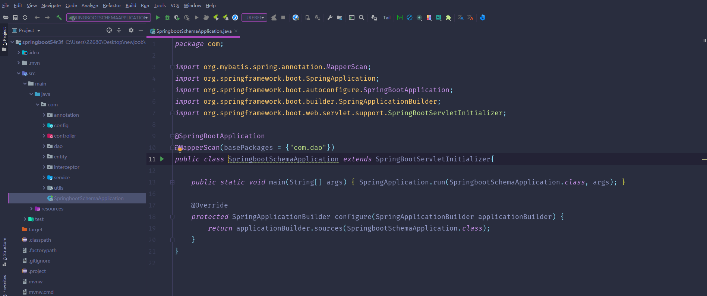

数据库表

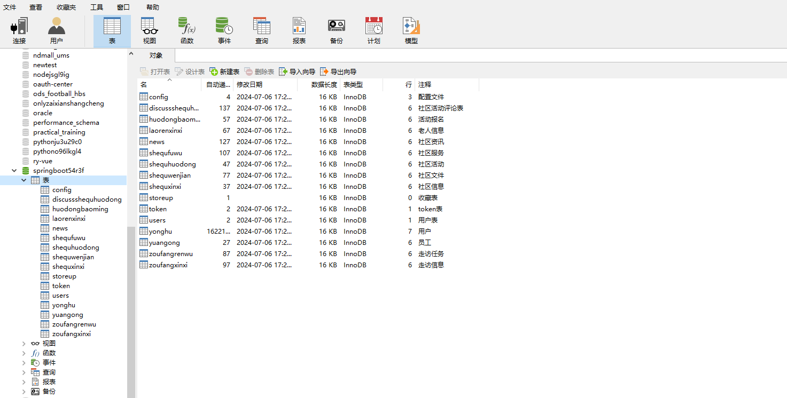

登录

前台页面首页

社区信息

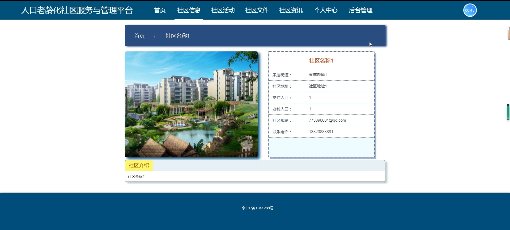

社区活动

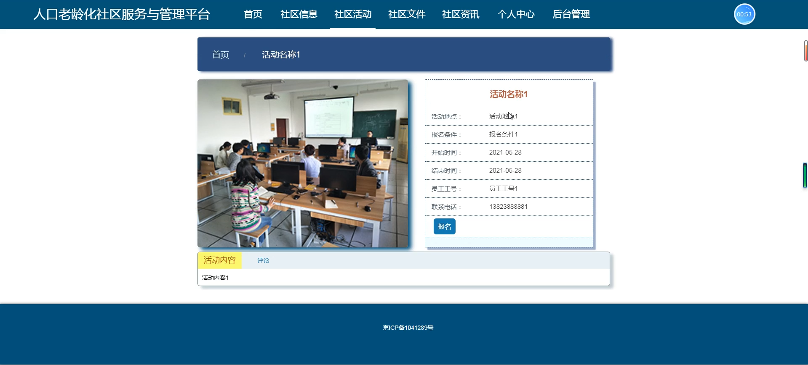

社区文件

社区资讯

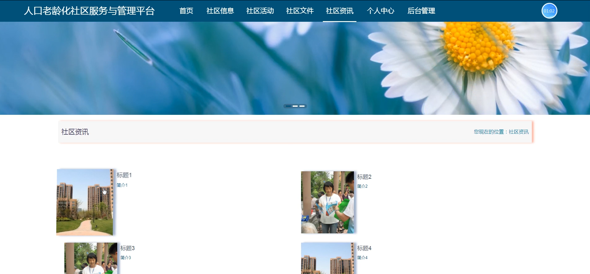

个人中心

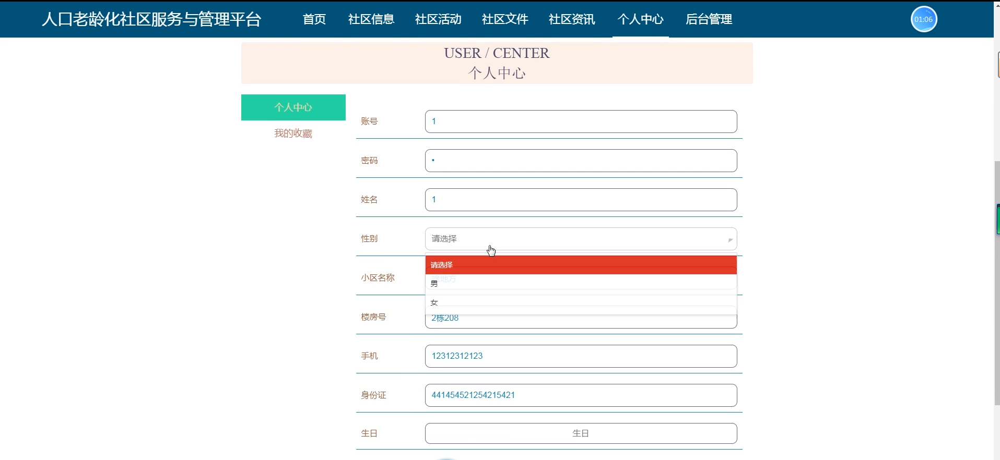

用户端后台管理

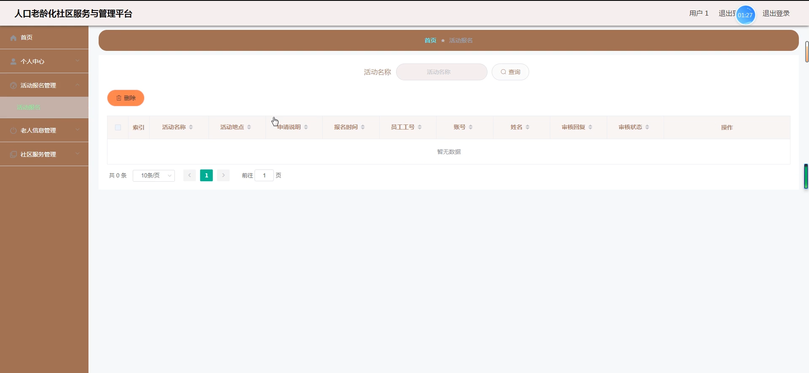

管理员端用户管理

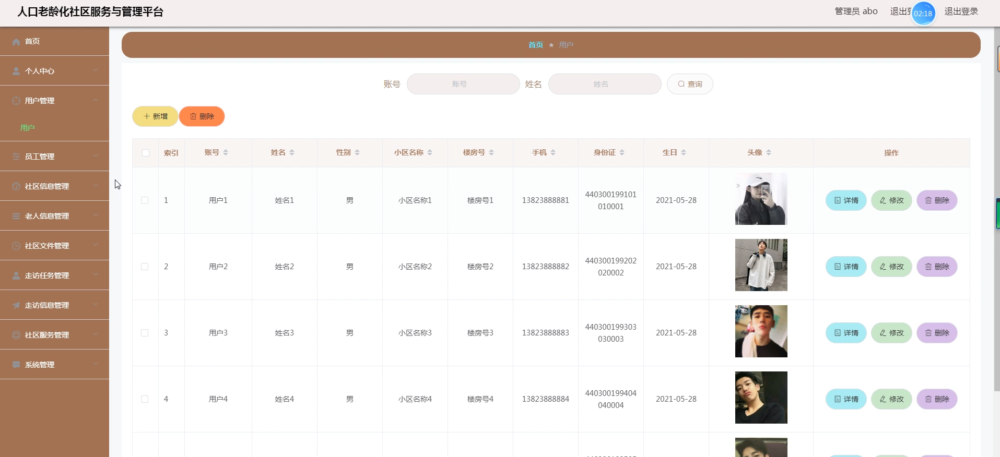

社区信息管理

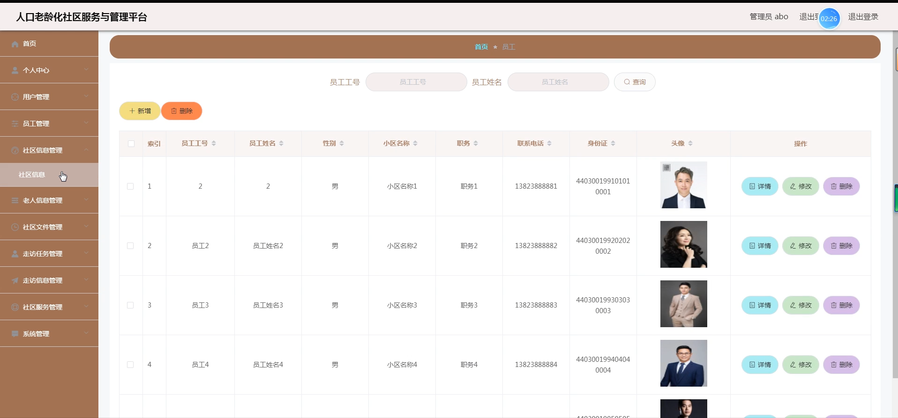

老人信息管理

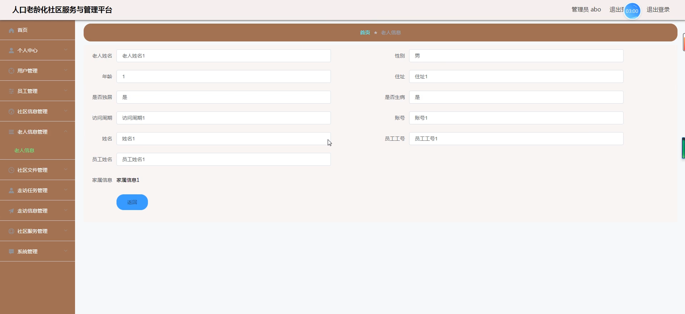

走访任务管理

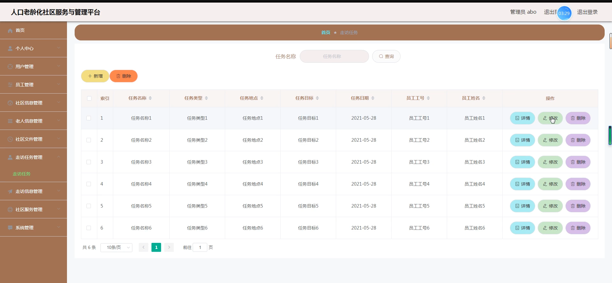

系统管理

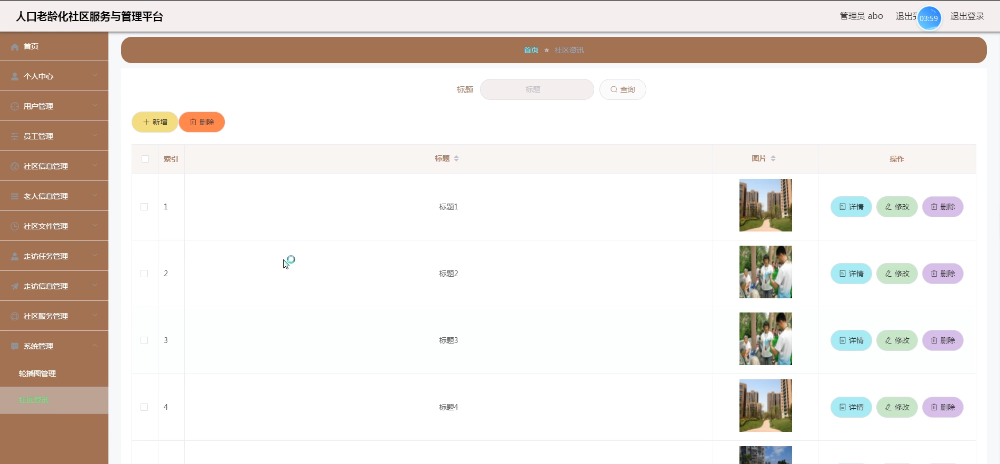

员工端后台管理

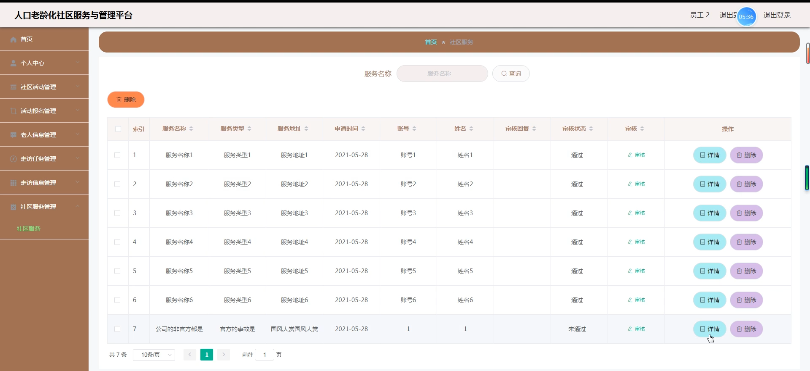

用户端后台管理

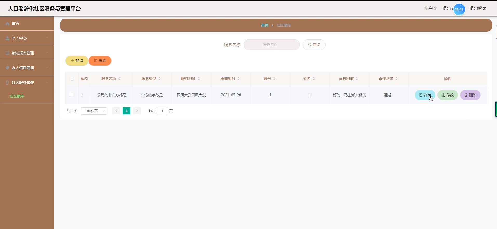

#### 总结

基于 Spring Boot 的人口老龄化社区服务系统通过合理的角色划分和功能模块设计，实现了对社区服务的全面管理和优化。管理端能够有效地统筹规划和监督服务工作，员工端能够高效地执行服务任务，用户端则能够便捷地获取服务和参与社区活动。该系统为应对人口老龄化挑战，提升社区服务水平，构建温馨、和谐的老龄化社区环境提供了有力的技术支持，有助于提高老年人的生活质量，促进社区的可持续发展。未来，我们还将不断完善和优化该系统，以适应不断变化的社区服务需求和老龄化社会的发展趋势。

#### 使用说明

创建数据库，执行数据库脚本 修改jdbc数据库连接参数 下载安装maven依赖jar 启动idea中的springboot项目

后台地址：http://localhost:8080/springboot54r3f/admin/dist/index.html

管理员  abo 密码 abo

前台地址：http://localhost:8080/springboot54r3f/front/index.html